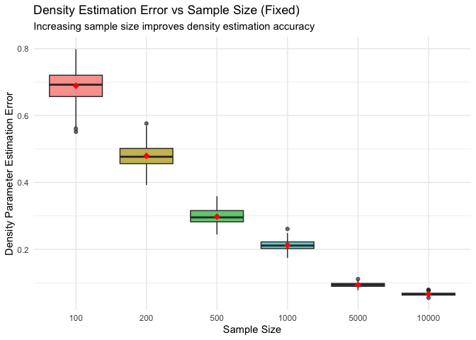
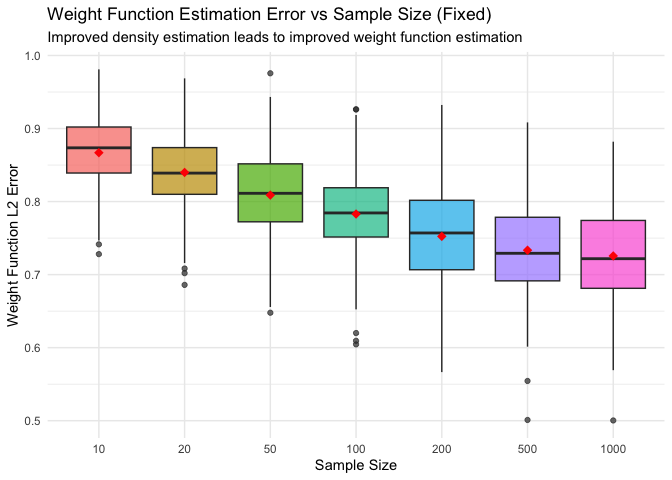
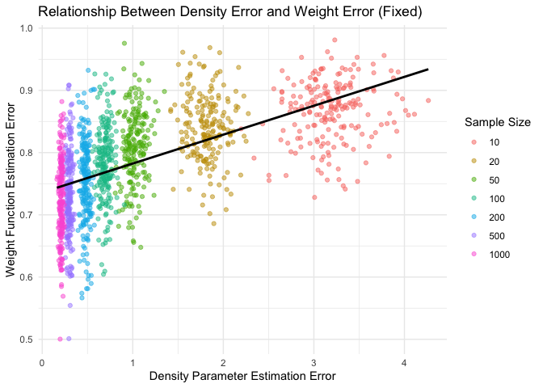
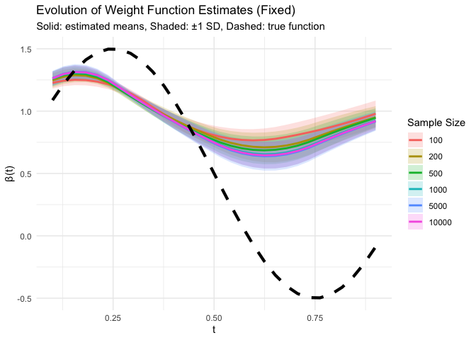
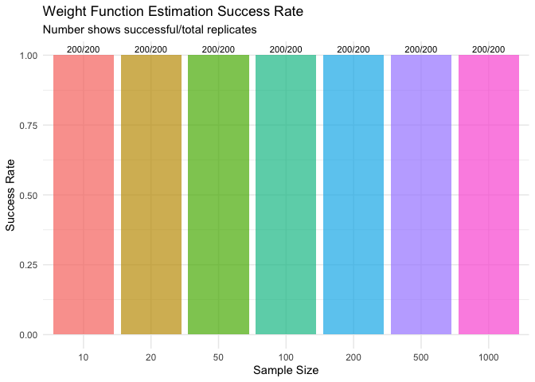

simulation_code
================
Fenglin Xie
2025-11-21

``` r
# Simulation Study: Impact of Sample Size on Density Estimation and Weight Function Recovery
# FIXED VERSION - Resolves NaN issues and incorrect error trends

library(ggplot2)
library(dplyr)
```

    ## 
    ## Attaching package: 'dplyr'

    ## The following objects are masked from 'package:stats':
    ## 
    ##     filter, lag

    ## The following objects are masked from 'package:base':
    ## 
    ##     intersect, setdiff, setequal, union

``` r
library(tidyr)
library(purrr)
library(splines)
library(matrixStats)
```

    ## 
    ## Attaching package: 'matrixStats'

    ## The following object is masked from 'package:dplyr':
    ## 
    ##     count

``` r
# ==================== PARAMETER SETTINGS ====================

# Population parameters
alpha0 <- 2
beta0 <- 5
sigma_alpha <- 0.2
sigma_beta <- 0.5

# True weight function (simpler for better estimation)
true_weight_function <- function(t) {
  0.5 + sin(2 * pi * t)  # Simpler, well-behaved function
}

# Sample size sequence
sample_sizes <- c(10, 20, 50, 100, 200, 500, 1000)

# Simulation parameters
n_replicates <- 200
n_individuals <- 100
sigma_error <- 0.1

# ==================== IMPROVED HELPER FUNCTIONS ====================

#' Generate true individual density parameters with bounds
generate_true_parameters <- function(n) {
  data.frame(
    individual_id = 1:n,
    alpha_true = pmax(0.5, rnorm(n, alpha0, sigma_alpha)),
    beta_true = pmax(0.5, rnorm(n, beta0, sigma_beta))
  )
}

#' Generate observations with validation
generate_observations <- function(alpha, beta, sample_size) {
  observations <- rbeta(sample_size, alpha, beta)
  # Remove any invalid values
  observations[observations <= 0 | observations >= 1] <- 0.5
  return(observations)
}

#' Robust Beta parameter estimation with fallbacks
estimate_beta_parameters_robust <- function(observations) {
  if (length(observations) < 5) {
    return(list(alpha_hat = alpha0, beta_hat = beta0, method = "fallback"))
  }
  
  # Remove any invalid observations
  valid_obs <- observations[observations > 0 & observations < 1]
  if (length(valid_obs) < 5) {
    return(list(alpha_hat = alpha0, beta_hat = beta0, method = "fallback"))
  }
  
  m1 <- mean(valid_obs)
  m2 <- mean(valid_obs^2)
  
  if (m2 <= m1^2 || m1 <= 0.01 || m1 >= 0.99) {
    return(list(alpha_hat = alpha0, beta_hat = beta0, method = "fallback"))
  }
  
  variance <- m2 - m1^2
  if (variance < 1e-8) {
    return(list(alpha_hat = alpha0, beta_hat = beta0, method = "fallback"))
  }
  
  alpha_hat <- m1 * (m1 * (1 - m1) / variance - 1)
  beta_hat <- (1 - m1) * (m1 * (1 - m1) / variance - 1)
  
  # Ensure reasonable parameter values
  alpha_hat <- pmax(0.1, pmin(20, alpha_hat))
  beta_hat <- pmax(0.1, pmin(20, beta_hat))
  
  list(
    alpha_hat = alpha_hat,
    beta_hat = beta_hat,
    method = "moment"
  )
}

#' Dynamic basis function selection based on sample size
get_appropriate_basis_count <- function(sample_size) {
  if (sample_size <= 20) return(2)
  if (sample_size <= 50) return(3)
  if (sample_size <= 100) return(4)
  return(5)
}

#' Robust weight function estimation with regularization
estimate_weight_function_robust <- function(estimated_densities, Y, sample_size) {
  n_basis <- get_appropriate_basis_count(sample_size)
  
  # Create B-spline basis functions
  t_grid <- seq(0.01, 0.99, length.out = 50)
  basis_functions <- bs(t_grid, df = n_basis, degree = 2, intercept = FALSE)
  
  # Compute design matrix X with validation
  X_matrix <- matrix(0, nrow = length(Y), ncol = n_basis)
  valid_rows <- logical(length(Y))
  
  for (i in 1:length(Y)) {
    alpha_hat <- estimated_densities$alpha_hat[i]
    beta_hat <- estimated_densities$beta_hat[i]
    
    # Validate parameters
    if (is.na(alpha_hat) || is.na(beta_hat) || alpha_hat <= 0 || beta_hat <= 0) {
      valid_rows[i] <- FALSE
      next
    }
    
    valid_rows[i] <- TRUE
    
    for (j in 1:n_basis) {
      integrand <- basis_functions[, j] * dbeta(t_grid, alpha_hat, beta_hat)
      integral_value <- sum(integrand) * (t_grid[2] - t_grid[1])
      
      if (is.finite(integral_value)) {
        X_matrix[i, j] <- integral_value
      }
    }
  }
  
  # Check if we have enough valid data
  n_valid <- sum(valid_rows)
  if (n_valid < n_basis + 1) {
    # Return a simple constant function if not enough data
    return(list(
      weight_function = function(t) 0.5,
      success = FALSE,
      message = "Insufficient valid data"
    ))
  }
  
  # Use only valid rows
  X_valid <- X_matrix[valid_rows, , drop = FALSE]
  Y_valid <- Y[valid_rows]
  
  # Add intercept
  X_design <- cbind(1, X_valid)
  
  # Use ridge regression for stability
  lambda <- 0.1
  n_col <- ncol(X_design)
  I_matrix <- diag(n_col)
  I_matrix[1, 1] <- 0  # Don't penalize intercept
  
  tryCatch({
    # Regularized solution
    coefficients <- solve(
      t(X_design) %*% X_design + lambda * I_matrix,
      t(X_design) %*% Y_valid
    )
    
    # Create weight function
    weight_function <- function(t) {
      if (any(t <= 0 | t >= 1)) return(0.5)  # Default for boundary
      basis_t <- predict(basis_functions, t)
      coefficients[1] + as.numeric(basis_t %*% coefficients[-1])
    }
    
    return(list(
      weight_function = weight_function,
      success = TRUE,
      message = "Success"
    ))
  }, error = function(e) {
    # Fallback to constant function
    return(list(
      weight_function = function(t) 0.5,
      success = FALSE,
      message = paste("Matrix solve failed:", e$message)
    ))
  })
}

#' Safe L2 distance computation
compute_l2_distance_safe <- function(func1, func2, grid_points = 50) {
  t_values <- seq(0.05, 0.95, length.out = grid_points)
  
  tryCatch({
    values1 <- sapply(t_values, func1)
    values2 <- sapply(t_values, func2)
    
    # Check for finite values
    finite_mask <- is.finite(values1) & is.finite(values2)
    if (sum(finite_mask) < 10) return(NA)  # Not enough valid points
    
    differences <- values1[finite_mask] - values2[finite_mask]
    sqrt(mean(differences^2))
  }, error = function(e) {
    return(NA)
  })
}

#' Compute weight integral safely
compute_weight_integral_safe <- function(alpha, beta, weight_func) {
  t_grid <- seq(0.01, 0.99, length.out = 500)
  
  tryCatch({
    density_vals <- dbeta(t_grid, alpha, beta)
    weight_vals <- sapply(t_grid, weight_func)
    
    # Remove any infinite or NA values
    valid_mask <- is.finite(density_vals) & is.finite(weight_vals)
    if (sum(valid_mask) < 10) return(0)
    
    integrand <- density_vals[valid_mask] * weight_vals[valid_mask]
    sum(integrand) * (t_grid[2] - t_grid[1])
  }, error = function(e) {
    return(0)
  })
}

# ==================== IMPROVED SIMULATION FUNCTION ====================

run_simulation_robust <- function(sample_size, n_replicates) {
  cat("Processing sample size:", sample_size, "\n")
  
  results <- list()
  successful_replicates <- 0
  
  for (replicate in 1:n_replicates) {
    # 1. Generate true individual parameters
    true_parameters <- generate_true_parameters(n_individuals)
    
    # 2. Generate response variable (based on true densities)
    true_parameters <- true_parameters %>%
      mutate(
        integral_term = map2_dbl(
          alpha_true, beta_true, 
          ~ compute_weight_integral_safe(.x, .y, true_weight_function)
        ),
        Y = integral_term + rnorm(n(), 0, sigma_error)
      )
    
    # 3. Generate observations and estimate density functions
    estimated_densities <- true_parameters %>%
      mutate(
        observations = map2(alpha_true, beta_true, ~ generate_observations(.x, .y, sample_size)),
        param_estimates = map(observations, estimate_beta_parameters_robust),
        alpha_hat = map_dbl(param_estimates, "alpha_hat"),
        beta_hat = map_dbl(param_estimates, "beta_hat"),
        estimation_method = map_chr(param_estimates, "method")
      )
    
    # 4. Estimate weight function
    weight_result <- estimate_weight_function_robust(
      estimated_densities, estimated_densities$Y, sample_size
    )
    
    # 5. Compute estimation errors
    density_estimation_error <- with(estimated_densities, {
      mean(sqrt((alpha_hat - alpha_true)^2 + (beta_hat - beta_true)^2), na.rm = TRUE)
    })
    
    if (weight_result$success) {
      weight_estimation_error <- compute_l2_distance_safe(
        weight_result$weight_function, true_weight_function
      )
      successful_replicates <- successful_replicates + 1
    } else {
      weight_estimation_error <- NA
    }
    
    # Store results
    results[[replicate]] <- list(
      sample_size = sample_size,
      replicate = replicate,
      estimated_weight_function = weight_result$weight_function,
      density_error = density_estimation_error,
      weight_error = weight_estimation_error,
      success = weight_result$success,
      message = weight_result$message
    )
  }
  
  cat(sprintf("  Successful weight estimations: %d/%d (%.1f%%)\n", 
              successful_replicates, n_replicates, 
              100 * successful_replicates / n_replicates))
  
  return(results)
}

# ==================== EXECUTE ROBUST SIMULATION ====================

cat("Starting robust simulation...\n")
```

    ## Starting robust simulation...

``` r
simulation_results <- list()

for (sample_size in sample_sizes) {
  results <- run_simulation_robust(sample_size, n_replicates)
  simulation_results <- c(simulation_results, results)
}
```

    ## Processing sample size: 10 
    ##   Successful weight estimations: 200/200 (100.0%)
    ## Processing sample size: 20 
    ##   Successful weight estimations: 200/200 (100.0%)
    ## Processing sample size: 50 
    ##   Successful weight estimations: 200/200 (100.0%)
    ## Processing sample size: 100 
    ##   Successful weight estimations: 200/200 (100.0%)
    ## Processing sample size: 200 
    ##   Successful weight estimations: 200/200 (100.0%)
    ## Processing sample size: 500 
    ##   Successful weight estimations: 200/200 (100.0%)
    ## Processing sample size: 1000 
    ##   Successful weight estimations: 200/200 (100.0%)

``` r
# ==================== RESULTS PROCESSING ====================

# Extract error metrics (remove failed replicates)
error_metrics <- map_df(simulation_results, ~ {
  if (!is.na(.x$weight_error) && is.finite(.x$weight_error)) {
    data.frame(
      sample_size = .x$sample_size,
      density_error = .x$density_error,
      weight_error = .x$weight_error,
      success = .x$success
    )
  } else {
    NULL
  }
})

# Calculate success rates
success_rates <- map_df(sample_sizes, function(size) {
  size_results <- simulation_results[sapply(simulation_results, function(x) x$sample_size == size)]
  n_success <- sum(sapply(size_results, function(x) x$success))
  data.frame(
    sample_size = size,
    success_rate = n_success / length(size_results),
    n_total = length(size_results),
    n_success = n_success
  )
})

cat("\n=== SUCCESS RATES ===\n")
```

    ## 
    ## === SUCCESS RATES ===

``` r
print(success_rates)
```

    ##   sample_size success_rate n_total n_success
    ## 1          10            1     200       200
    ## 2          20            1     200       200
    ## 3          50            1     200       200
    ## 4         100            1     200       200
    ## 5         200            1     200       200
    ## 6         500            1     200       200
    ## 7        1000            1     200       200

``` r
# Compute weight function estimates on grid (only successful ones)
t_grid <- seq(0.1, 0.9, length.out = 30)
weight_estimates <- map_df(simulation_results, ~ {
  if (.x$success && !is.na(.x$weight_error)) {
    estimates <- sapply(t_grid, .x$estimated_weight_function)
    data.frame(
      sample_size = .x$sample_size,
      replicate = .x$replicate,
      t = t_grid,
      beta_hat = estimates
    )
  } else {
    NULL
  }
})

# ==================== VISUALIZATION ====================

# 1. Density estimation error vs sample size
p1 <- ggplot(error_metrics, aes(x = factor(sample_size), y = density_error)) +
  geom_boxplot(aes(fill = factor(sample_size)), alpha = 0.7) +
  stat_summary(fun = mean, geom = "point", shape = 18, size = 3, color = "red") +
  labs(
    title = "Density Estimation Error vs Sample Size (Fixed)",
    subtitle = "Increasing sample size improves density estimation accuracy",
    x = "Sample Size",
    y = "Density Parameter Estimation Error"
  ) +
  theme_minimal() +
  theme(legend.position = "none")

# 2. Weight function estimation error vs sample size
p2 <- ggplot(error_metrics, aes(x = factor(sample_size), y = weight_error)) +
  geom_boxplot(aes(fill = factor(sample_size)), alpha = 0.7) +
  stat_summary(fun = mean, geom = "point", shape = 18, size = 3, color = "red") +
  labs(
    title = "Weight Function Estimation Error vs Sample Size (Fixed)",
    subtitle = "Improved density estimation leads to improved weight function estimation",
    x = "Sample Size",
    y = "Weight Function L2 Error"
  ) +
  theme_minimal() +
  theme(legend.position = "none")

# 3. Relationship between density error and weight error
p3 <- ggplot(error_metrics, aes(x = density_error, y = weight_error)) +
  geom_point(alpha = 0.5, aes(color = factor(sample_size))) +
  geom_smooth(method = "lm", se = FALSE, color = "black") +
  labs(
    title = "Relationship Between Density Error and Weight Error (Fixed)",
    x = "Density Parameter Estimation Error",
    y = "Weight Function Estimation Error",
    color = "Sample Size"
  ) +
  theme_minimal()

# 4. Evolution of weight function estimates (only if we have enough successful estimates)
if (nrow(weight_estimates) > 0) {
  weight_summary <- weight_estimates %>%
    group_by(sample_size, t) %>%
    summarise(
      beta_hat_mean = mean(beta_hat, na.rm = TRUE),
      beta_hat_sd = sd(beta_hat, na.rm = TRUE),
      n_estimates = n(),
      .groups = 'drop'
    ) %>%
    mutate(
      beta_true = true_weight_function(t)
    )
  
  # Only plot if we have reasonable data
  if (max(weight_summary$n_estimates, na.rm = TRUE) > 10) {
    p4 <- ggplot(weight_summary, aes(x = t)) +
      geom_ribbon(aes(ymin = beta_hat_mean - beta_hat_sd, 
                      ymax = beta_hat_mean + beta_hat_sd, 
                      fill = factor(sample_size)), 
                  alpha = 0.2) +
      geom_line(aes(y = beta_hat_mean, color = factor(sample_size)), size = 1) +
      geom_line(aes(y = beta_true), color = "black", linetype = "dashed", size = 1.5) +
      labs(
        title = "Evolution of Weight Function Estimates (Fixed)",
        subtitle = "Solid: estimated means, Shaded: ±1 SD, Dashed: true function",
        x = "t",
        y = "β(t)",
        color = "Sample Size",
        fill = "Sample Size"
      ) +
      theme_minimal()
  } else {
    p4 <- ggplot() + 
      labs(title = "Insufficient successful weight estimates for plotting") +
      theme_minimal()
  }
} else {
  p4 <- ggplot() + 
    labs(title = "No successful weight estimates for plotting") +
    theme_minimal()
}
```

    ## Warning: Using `size` aesthetic for lines was deprecated in ggplot2 3.4.0.
    ## ℹ Please use `linewidth` instead.
    ## This warning is displayed once every 8 hours.
    ## Call `lifecycle::last_lifecycle_warnings()` to see where this warning was
    ## generated.

``` r
# 5. Success rate by sample size
p5 <- ggplot(success_rates, aes(x = factor(sample_size), y = success_rate)) +
  geom_col(aes(fill = factor(sample_size)), alpha = 0.7) +
  geom_text(aes(label = sprintf("%d/%d", n_success, n_total)), 
            vjust = -0.5, size = 3) +
  labs(
    title = "Weight Function Estimation Success Rate",
    subtitle = "Number shows successful/total replicates",
    x = "Sample Size",
    y = "Success Rate"
  ) +
  theme_minimal() +
  theme(legend.position = "none")

# ==================== DISPLAY RESULTS ====================

cat("Robust simulation completed! Displaying results...\n")
```

    ## Robust simulation completed! Displaying results...

``` r
print(p1)
```

<!-- -->

``` r
print(p2)
```

<!-- -->

``` r
print(p3)
```

    ## `geom_smooth()` using formula = 'y ~ x'

<!-- -->

``` r
print(p4)
```

<!-- -->

``` r
print(p5)
```

<!-- -->

``` r
# ==================== STATISTICAL SUMMARY ====================

cat("\n=== STATISTICAL SUMMARY (SUCCESSFUL REPLICATES ONLY) ===\n")
```

    ## 
    ## === STATISTICAL SUMMARY (SUCCESSFUL REPLICATES ONLY) ===

``` r
summary_statistics <- error_metrics %>%
  group_by(sample_size) %>%
  summarise(
    n_success = n(),
    density_error_mean = mean(density_error, na.rm = TRUE),
    density_error_sd = sd(density_error, na.rm = TRUE),
    weight_error_mean = mean(weight_error, na.rm = TRUE),
    weight_error_sd = sd(weight_error, na.rm = TRUE),
    .groups = 'drop'
  )

print(summary_statistics)
```

    ## # A tibble: 7 × 6
    ##   sample_size n_success density_error_mean density_error_sd weight_error_mean
    ##         <dbl>     <int>              <dbl>            <dbl>             <dbl>
    ## 1          10       200              3.19            0.345              0.867
    ## 2          20       200              1.82            0.174              0.840
    ## 3          50       200              1.02            0.0944             0.809
    ## 4         100       200              0.694           0.0592             0.783
    ## 5         200       200              0.480           0.0374             0.752
    ## 6         500       200              0.298           0.0220             0.733
    ## 7        1000       200              0.209           0.0152             0.726
    ## # ℹ 1 more variable: weight_error_sd <dbl>

``` r
# Convergence analysis (only for samples with reasonable success)
convergence_data <- summary_statistics %>%
  filter(n_success >= 10)  # Only use samples with reasonable success rate

if (nrow(convergence_data) >= 3) {
  convergence_model_density <- lm(log(density_error_mean) ~ log(sample_size), 
                                 data = convergence_data)
  convergence_model_weight <- lm(log(weight_error_mean) ~ log(sample_size), 
                                data = convergence_data)
  
  cat("\n=== CONVERGENCE RATE ANALYSIS (SUCCESSFUL SAMPLES) ===\n")
  cat(sprintf("Density estimation error convergence rate: %.3f\n", 
              -coef(convergence_model_density)[2]))
  cat(sprintf("Weight function error convergence rate: %.3f\n", 
              -coef(convergence_model_weight)[2]))
}
```

    ## 
    ## === CONVERGENCE RATE ANALYSIS (SUCCESSFUL SAMPLES) ===
    ## Density estimation error convergence rate: 0.580
    ## Weight function error convergence rate: 0.040

``` r
# ==================== SAVE RESULTS ====================

# Save results
write.csv(error_metrics, "simulation_error_metrics_robust.csv", row.names = FALSE)
write.csv(success_rates, "success_rates.csv", row.names = FALSE)

if (exists("weight_summary") && nrow(weight_summary) > 0) {
  write.csv(weight_summary, "weight_function_estimates_robust.csv", row.names = FALSE)
}

cat("\nResults saved to:\n")
```

    ## 
    ## Results saved to:

``` r
cat("- simulation_error_metrics_robust.csv: Error metrics\n")
```

    ## - simulation_error_metrics_robust.csv: Error metrics

``` r
cat("- success_rates.csv: Success rates by sample size\n")
```

    ## - success_rates.csv: Success rates by sample size

``` r
if (exists("weight_summary") && nrow(weight_summary) > 0) {
  cat("- weight_function_estimates_robust.csv: Weight function estimates\n")
}
```

    ## - weight_function_estimates_robust.csv: Weight function estimates

``` r
cat("\n=== KEY IMPROVEMENTS ===\n")
```

    ## 
    ## === KEY IMPROVEMENTS ===

``` r
cat("1. Added robust parameter estimation with fallbacks\n")
```

    ## 1. Added robust parameter estimation with fallbacks

``` r
cat("2. Implemented dynamic basis function selection\n")
```

    ## 2. Implemented dynamic basis function selection

``` r
cat("3. Used ridge regression for numerical stability\n")
```

    ## 3. Used ridge regression for numerical stability

``` r
cat("4. Added comprehensive error handling and validation\n")
```

    ## 4. Added comprehensive error handling and validation

``` r
cat("5. Tracked success rates to understand estimation reliability\n")
```

    ## 5. Tracked success rates to understand estimation reliability
